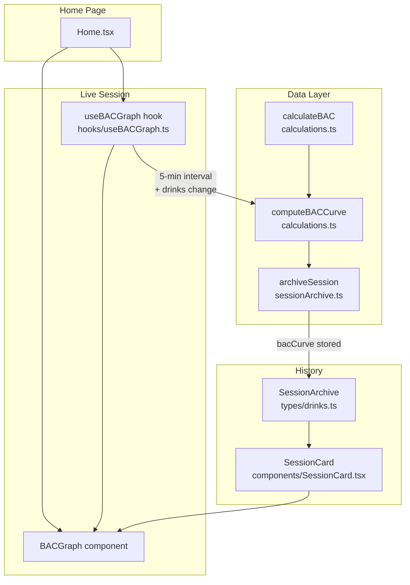

# Design Document: BAC Graph

## Overview

The BAC Graph feature adds a time-series SVG line chart of Blood Alcohol Concentration to Beer O'Clock. It has two rendering contexts:

1. **Live graph on Home** — refreshes every 5 minutes via `setInterval`, recomputes immediately on drink changes, shown when an active session exists and a profile is set.
2. **Archived graph in SessionCard** — static, no timer, rendered when a session card is expanded and the archive contains a `bacCurve`.

No charting library is added. The graph is a hand-rolled inline SVG built from the existing `calculateBAC` pure function. All colours use Tailwind CSS v4 CSS variables so the graph respects the current theme automatically.

---

## Architecture



Key design decisions:

- `computeBACCurve` is a **pure function** in `calculations.ts` — easy to test, no side effects.
- The live timer lives in a dedicated `useBACGraph` hook, keeping `Home.tsx` clean.
- `BACGraph` is a **pure presentational component** — it receives `snapshots`, `startTime`, `endTime` and renders SVG. No timers, no data fetching.
- `archiveSession` is extended to call `computeBACCurve` so the curve is stored once at archive time.

---

## Components and Interfaces

### `computeBACCurve` (pure utility)

```ts
// frontend/src/utils/calculations.ts
export function computeBACCurve(
  drinks: Drink[],
  allBeers: Beer[],
  profile: UserProfile | null,
  startTime: number,
  endTime: number,
  intervalMs: number = 300_000,
): BACSnapshot[];
```

- Samples BAC at every `intervalMs` from `startTime` to `endTime` inclusive.
- Always appends a snapshot at exactly `endTime` (deduped if it coincides with a regular tick).
- Returns `[]` when `profile` is `null` or `drinks` is empty.
- Uses the same `getGramsAlcohol` closure pattern already used in `sessionArchive.ts`.

### `useBACGraph` hook

```ts
// frontend/src/hooks/useBACGraph.ts
export function useBACGraph(
  drinks: Drink[],
  allBeers: Beer[],
  profile: UserProfile | null,
): { snapshots: BACSnapshot[]; startTime: number; endTime: number };
```

- Maintains a `currentTime` state updated by a 300 000 ms `setInterval`.
- Recomputes `snapshots` via `useMemo` whenever `drinks`, `allBeers`, `profile`, or `currentTime` changes — so drink add/remove triggers immediate recompute.
- `startTime` = first drink timestamp; `endTime` = `currentTime`.
- Returns empty snapshots when `drinks.length === 0` or `profile` is null.

### `BACGraph` component

```ts
// frontend/src/components/BACGraph.tsx
interface BACGraphProps {
  snapshots: BACSnapshot[];
  startTime: number;
  endTime: number;
  className?: string;
}
export function BACGraph(props: BACGraphProps): JSX.Element;
```

- Renders an inline `<svg>` with `viewBox="0 0 600 200"` and `width="100%"` for responsive scaling (3:1 aspect ratio).
- Internal padding: 40px left (y-axis labels), 10px right, 24px bottom (x-axis labels), 10px top.
- Coordinate mapping: linear scale from `[startTime, endTime]` → x-axis, `[0, maxBAC * 1.2]` → y-axis (clamped to at least 0.15).
- Renders:
  - BAC line path (`<polyline>` or `<path>`)
  - Dashed horizontal reference line at y = 0.05
  - "0.05 limit" text label on the reference line
  - Y-axis tick labels (0.00, 0.05, 0.10, 0.15, …)
  - X-axis tick labels (hours elapsed: 0h, 1h, 2h, …)
  - Peak BAC annotation dot + label
- Empty state: when `snapshots` is empty or all BAC values are zero, renders a centred `<text>` message.
- All colours via CSS variables: `var(--color-foreground)`, `var(--color-muted-foreground)`, `var(--color-primary)`.

### `SessionArchive` type extension

```ts
// frontend/src/types/drinks.ts
export interface BACSnapshot {
  timestamp: number; // epoch ms
  bac: number;
}

export interface SessionArchive {
  // ... existing fields ...
  bacCurve?: BACSnapshot[]; // optional for backwards compatibility
}
```

### `archiveSession` extension

`archiveSession` in `sessionArchive.ts` gains a call to `computeBACCurve(drinks, allBeers, profile, startTimestamp, endTimestamp)` and stores the result as `bacCurve` in the returned archive.

### `SessionCard` extension

When `expanded` is true and `archive.bacCurve` has at least one non-zero snapshot, render:

```tsx
<ErrorBoundary>
  <BACGraph
    snapshots={archive.bacCurve}
    startTime={archive.startTimestamp}
    endTime={archive.endTimestamp}
  />
</ErrorBoundary>
```

### `Home.tsx` extension

When `profile` is set and `drinks.length > 0`, render below `BACCard`:

```tsx
<ErrorBoundary>
  <BACGraph snapshots={snapshots} startTime={startTime} endTime={endTime} />
</ErrorBoundary>
```

where `{ snapshots, startTime, endTime }` come from `useBACGraph(drinks, allBeers, profile)`.

---

## Data Models

### `BACSnapshot`

| Field       | Type     | Description                    |
| ----------- | -------- | ------------------------------ |
| `timestamp` | `number` | Epoch milliseconds             |
| `bac`       | `number` | BAC value at that moment (≥ 0) |

### `SessionArchive` (extended)

| Field                 | Type             | Notes                                      |
| --------------------- | ---------------- | ------------------------------------------ |
| `startTimestamp`      | `number`         | Existing — first drink epoch ms            |
| `endTimestamp`        | `number`         | Existing — last drink + 7 200 000 ms       |
| `durationMinutes`     | `number`         | Existing                                   |
| `totalStandardDrinks` | `number`         | Existing                                   |
| `peakBAC`             | `number`         | Existing                                   |
| `drinks`              | `Drink[]`        | Existing                                   |
| `bacCurve`            | `BACSnapshot[]?` | New — optional for backwards compatibility |

### SVG coordinate model

```
viewBox: 0 0 600 200
padding: { top: 10, right: 10, bottom: 24, left: 40 }
plotWidth  = 600 - 40 - 10 = 550
plotHeight = 200 - 10 - 24 = 166

xScale(t) = left + (t - startTime) / (endTime - startTime) * plotWidth
yScale(b) = top + plotHeight - (b / maxY) * plotHeight   // inverted: 0 at bottom
```

---

## Correctness Properties

_A property is a characteristic or behavior that should hold true across all valid executions of a system — essentially, a formal statement about what the system should do. Properties serve as the bridge between human-readable specifications and machine-verifiable correctness guarantees._

### Property 1: Curve covers the full time range at the specified interval

_For any_ non-empty drinks array, valid profile, startTime, endTime, and intervalMs, the snapshots returned by `computeBACCurve` must:

- have timestamps that start at or before `startTime + intervalMs`
- be spaced exactly `intervalMs` apart (except the final point)
- include a snapshot with `timestamp === endTime` as the last point

**Validates: Requirements 1.3, 1.4, 3.2, 3.3**

### Property 2: Curve values are consistent with calculateBAC

_For any_ drinks array, beer catalogue, profile, and timestamp `t`, the BAC value at `t` in the curve produced by `computeBACCurve` must equal `calculateBAC(drinks, profile, t, getGramsAlcohol(allBeers))`.

**Validates: Requirements 1.6**

### Property 3: Null profile produces empty curve

_For any_ drinks array and time range, `computeBACCurve` with `profile = null` must return an empty array `[]`.

**Validates: Requirements 1.2, 3.4**

### Property 4: Drinks change triggers curve recompute

_For any_ initial drinks array and profile, adding or removing a drink from the array passed to `useBACGraph` must produce a different `snapshots` result (assuming the drink contributes non-zero BAC).

**Validates: Requirements 2.3, 2.4**

### Property 5: Peak BAC annotation is present and correct

_For any_ non-empty snapshots array with at least one non-zero BAC value, the `BACGraph` component must render an annotation whose label text equals the maximum BAC value in the snapshots (formatted to 2 decimal places).

**Validates: Requirements 4.4**

### Property 6: Axis labels reflect the session time range and BAC range

_For any_ snapshots array spanning a time range of `D` hours, the rendered SVG must contain x-axis labels for each whole hour from 0 to `floor(D)`, and y-axis labels for BAC values at 0.05 intervals up to at least the peak BAC value.

**Validates: Requirements 5.3, 5.4**

### Property 7: Archive always contains a bacCurve field

_For any_ non-empty drinks array and non-null profile, `archiveSession` must return a `SessionArchive` where `bacCurve` is a non-empty array of `BACSnapshot` objects.

**Validates: Requirements 3.1**

---

## Error Handling

| Scenario                         | Handling                                                                                  |
| -------------------------------- | ----------------------------------------------------------------------------------------- |
| `profile` is `null`              | `computeBACCurve` returns `[]`; `BACGraph` renders empty state message                    |
| `drinks` is empty                | `computeBACCurve` returns `[]`; `BACGraph` renders empty state message                    |
| All BAC values are zero          | `BACGraph` detects all-zero snapshots and renders empty state message                     |
| `startTime === endTime`          | Single snapshot at that time; graph renders a flat line                                   |
| `endTime < startTime`            | `computeBACCurve` returns `[]`; treated as empty                                          |
| SVG rendering throws             | `ErrorBoundary` at each call site catches the error and shows fallback UI                 |
| `bacCurve` absent on old archive | `SessionCard` checks `archive.bacCurve?.some(s => s.bac > 0)` before rendering            |
| Beer not found in catalogue      | `getGramsAlcohol` returns 0 for unknown beers (existing behaviour in `sessionArchive.ts`) |

---

## Testing Strategy

### Dual Testing Approach

Both unit tests and property-based tests are required. They are complementary:

- **Unit tests** cover specific examples, integration points, and edge cases.
- **Property tests** verify universal correctness across randomised inputs.

### Property-Based Testing Library

Use **[fast-check](https://github.com/dubzzz/fast-check)** (already compatible with Vitest). Each property test runs a minimum of **100 iterations**.

Each property test must be tagged with a comment in this format:

```
// Feature: bac-graph, Property N: <property text>
```

### Property Tests

| Property   | Test description                                                                                                                                                                                  |
| ---------- | ------------------------------------------------------------------------------------------------------------------------------------------------------------------------------------------------- |
| Property 1 | Generate random drinks, profile, startTime, endTime, intervalMs. Assert snapshot timestamps start ≤ startTime + intervalMs, are spaced intervalMs apart, and last snapshot timestamp === endTime. |
| Property 2 | Generate random drinks, beers, profile, and a random timestamp t within the range. Assert snapshot BAC at t equals `calculateBAC(drinks, profile, t, ...)`.                                       |
| Property 3 | Generate random drinks and time range with profile = null. Assert result is `[]`.                                                                                                                 |
| Property 4 | Generate random drinks + profile. Compute snapshots. Add a random drink. Assert new snapshots differ from original.                                                                               |
| Property 5 | Generate random non-empty snapshots with at least one non-zero BAC. Render `BACGraph`. Assert SVG text contains the max BAC formatted to 2dp.                                                     |
| Property 6 | Generate random snapshots spanning N hours. Render `BACGraph`. Assert SVG contains text labels "0h" through `${N}h` and BAC labels at 0.05 intervals.                                             |
| Property 7 | Generate random drinks + beers + profile. Call `archiveSession`. Assert `bacCurve` is a non-empty array of `{ timestamp, bac }` objects.                                                          |

### Unit Tests

- `computeBACCurve` with empty drinks → returns `[]`
- `computeBACCurve` with null profile → returns `[]`
- `computeBACCurve` with `startTime === endTime` → returns single snapshot
- `computeBACCurve` with `endTime < startTime` → returns `[]`
- `archiveSession` with null profile → `bacCurve` is `[]`
- `BACGraph` with empty snapshots → renders empty state text
- `BACGraph` with all-zero snapshots → renders empty state text
- `BACGraph` with valid snapshots → renders `<svg>` element with `width="100%"`
- `BACGraph` renders dashed reference line at y = 0.05
- `SessionCard` with `bacCurve` absent → does not render `BACGraph`
- `SessionCard` with all-zero `bacCurve` → does not render `BACGraph`
- `SessionCard` with valid `bacCurve` and expanded → renders `BACGraph`
- `useBACGraph` with empty drinks → returns empty snapshots
- `useBACGraph` sets interval of 300 000 ms

### Test File Locations

```
frontend/src/utils/__tests__/computeBACCurve.test.ts
frontend/src/components/__tests__/BACGraph.test.tsx
frontend/src/hooks/__tests__/useBACGraph.test.ts
frontend/src/utils/__tests__/archiveSession.test.ts   (extend existing)
frontend/src/components/__tests__/SessionCard.test.tsx (extend existing)
```
